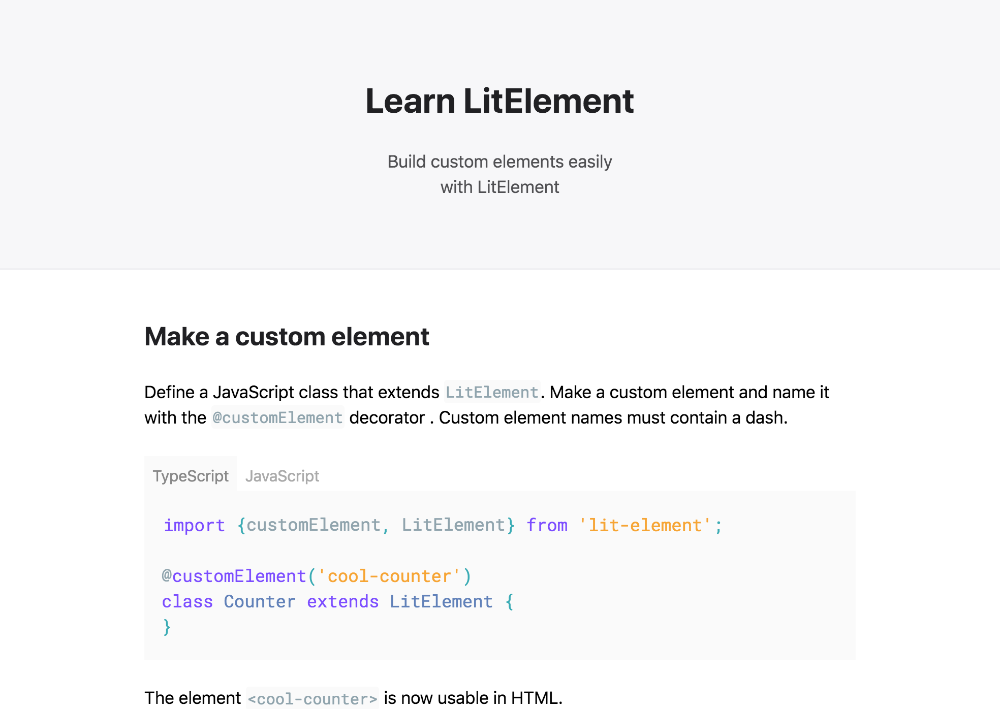

# Learn LitElement

Try it out:

`npm run dev`

This is a proof-of-concept for an abridged LitElement tutorial. It gets right to the point of LitElement's basic concepts.

### Why?

There are no LitElement tutorials that showcase **only** the basics.

### Intended Audience

An abridged tutorial would serve the following people:

* Beginner web developers and new grads
* Developers that don't need advanced LitElement features
* Developers that do need advanced features, but want to see basic concepts in action first.

For these groups, the existing tutorials and documentation can be intimidating. Existing tutorials are lengthy and prose-y. Existing documentation includes *all* LitElement features.

## What it looks like



## Developing the tutorial

Eleventy was once more integral to the setup, but now it's really only providing syntax highlighting. The syntax highlighter is also buggy:

Syntax highlighting not working? Try uncommenting the following
block (it's hidden in the README) and let eleventy rebuild & error out. For some reason this
seems to kick the syntax highlighter...

<!-- ```error
css`a { color: blue; }`;
``` -->
